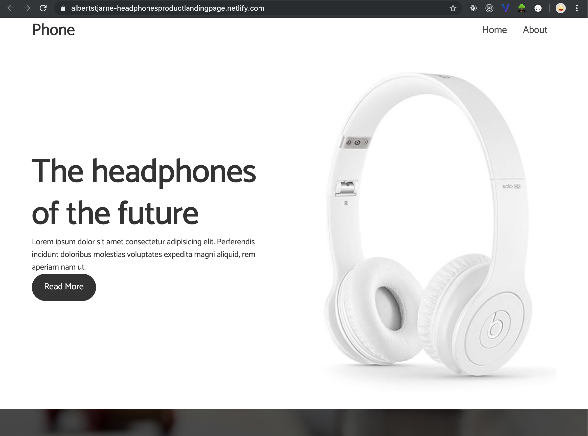
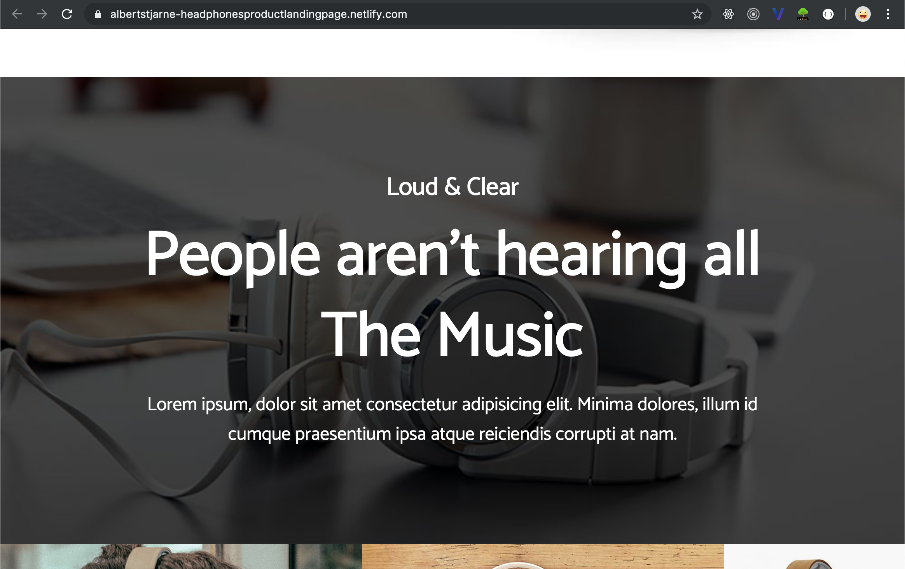
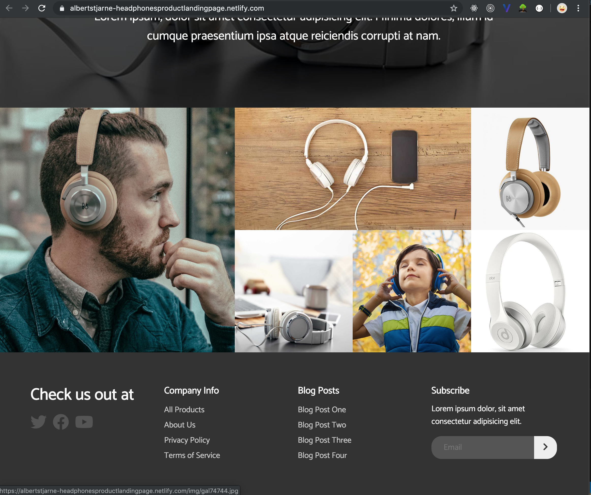
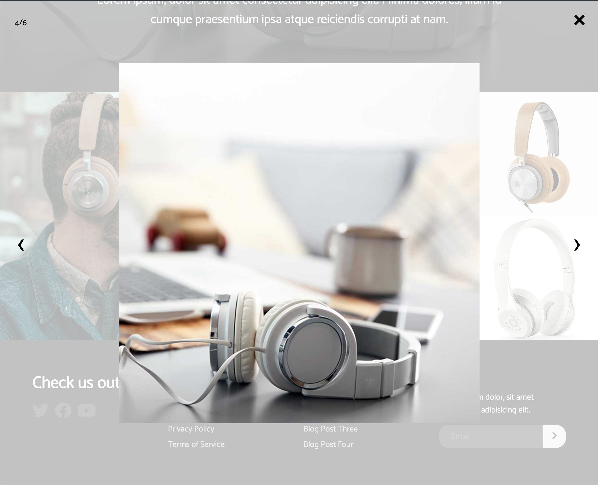

# Product landing page with HTML, CSS and simplelightbox library

A product landing page for a virtual headphone company.

Clicking an image in the images are will start the image carousell.

Icons are taken from fontawesome.

Media queries have been added for max-width of 700px. 

The page is deployed to Netlify with working submission form.

## Screenshots

Navbar & Showcase areas

Overlay area

Images & Footer

Image viewing carousell

## Author
* Albert Stjärne (https://github.com/AlbertStjarne)